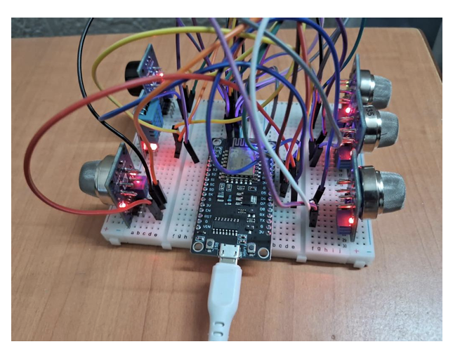
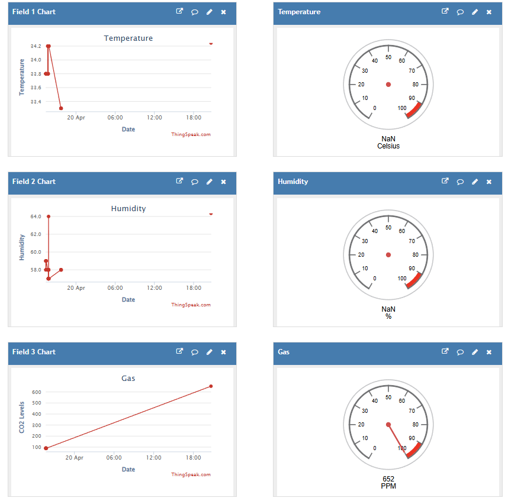
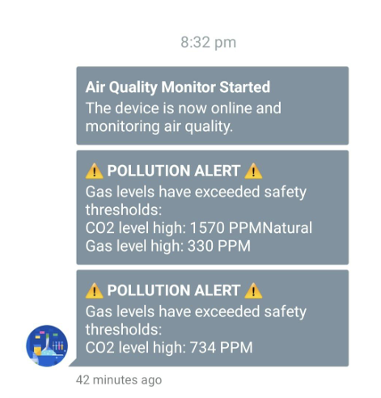

# 🌫️ Air Pollution Monitoring System

An IoT-based real-time air quality monitoring system using ESP8266 NodeMCU and multiple gas sensors. The system reads, analyzes, and visualizes key environmental data—and alerts users when hazardous gas levels are detected.

---

## 📋 Project Summary

This project monitors air quality using various gas and environmental sensors connected to a NodeMCU microcontroller. It uploads real-time data to **ThingSpeak** and sends alerts via **Pushbullet** when gas levels exceed predefined safety thresholds.

---

## 🧠 Features

- 📡 **IoT Integration**: WiFi-enabled data transmission to ThingSpeak.
- 📈 **Real-time Monitoring**: Continuous tracking of gas concentrations and environmental conditions.
- 🚨 **Pushbullet Alerts**: Instant alerts for dangerous gas levels.
- 📊 **Data Visualization**: Dynamic dashboard on ThingSpeak.
- 🔧 **Modular Design**: Easily extensible for additional sensors or features.

---

## 🧰 Tech Stack

### 💻 Hardware
- ESP8266 NodeMCU (Microcontroller)
- Gas Sensors:
  - MQ135 (CO₂)
  - MQ2 (LPG)
  - MQ7 (CO)
  - MQ8 (Hydrogen)
  - MQ4 (Methane/CH₄)
- DHT11 (Temperature & Humidity Sensor)

### 🧑‍💻 Software
- Arduino IDE (C++)
- Libraries:
  - `ESP8266WiFi`
  - `ESP8266HTTPClient`
  - `WiFiClientSecure`
  - `ArduinoJson`
  - `DHT`
  - Sensor-specific libraries

---

## 🔍 Functionality Breakdown

### 📥 Data Collection
- Temperature & Humidity from DHT11
- Gas concentrations from MQ-series sensors
- Sensor output is converted to PPM (parts per million)

### 📤 Data Transmission
- Uploads to **ThingSpeak** every 15 seconds
  - Field 1: Temperature 🌡️
  - Field 2: Humidity 💧
  - Field 3: CO₂
  - Field 4: LPG
  - Field 5: CO
  - Field 6: H₂
  - Field 7: CH₄

### 🔔 Alert System
- Pushbullet notifications when thresholds exceed:
  - CO₂ > 300 PPM
  - LPG > 100 PPM
  - CO > 50 PPM
  - H₂ > 100 PPM
  - CH₄ > 100 PPM
- Cooldown interval: 5 minutes to prevent spamming

---

## 🔩 Pin Configuration

| Sensor  | NodeMCU Pin |
|---------|-------------|
| MQ135   | A0          |
| MQ2     | D1 (GPIO5)  |
| MQ7     | D6 (GPIO12) |
| MQ8     | D3 (GPIO0)  |
| MQ4     | D4 (GPIO2)  |
| DHT11   | D2 (GPIO4)  |

---

## 🧠 Challenges & Solutions

| Challenge                        | Solution                                                     |
|----------------------------------|--------------------------------------------------------------|
| High IRAM Usage                 | Moved infrequent functions to flash memory                   |
| HTTPS Connection Failures       | Used certificate verification skipping with secure clients   |
| Gas Sensor Calibration Issues   | Added warm-up time and manual tuning                         |

---

## 🔮 Future Enhancements

- 🔋 **Power Optimization** using deep sleep mode
- 💾 **Offline Data Logging** via SD card
- 📱 **Mobile App** for real-time monitoring
- 🧠 **ML Integration** to predict future pollution spikes
- 🌐 **Sensor Network Expansion** for area-wide data

---

## 🧑‍🤝‍🧑 Contributors

- Ayush Ranjan Prasad
- Rahul Palaniappan

---

## 📷 Screenshots
### 🖼️ Circuit Connections

---

### 📊 ThingSpeak Dashboard

---

### 📱 Pushbullet Alert Example

---

## 🔗 Useful Links

- [ThingSpeak](https://thingspeak.com/)
- [Pushbullet](https://www.pushbullet.com/)
- [ESP8266 Documentation](https://github.com/esp8266/Arduino)

